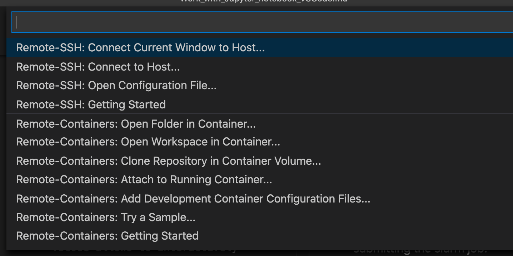
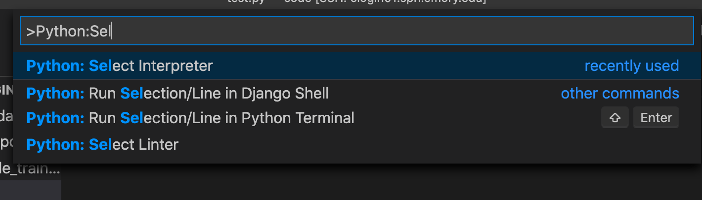
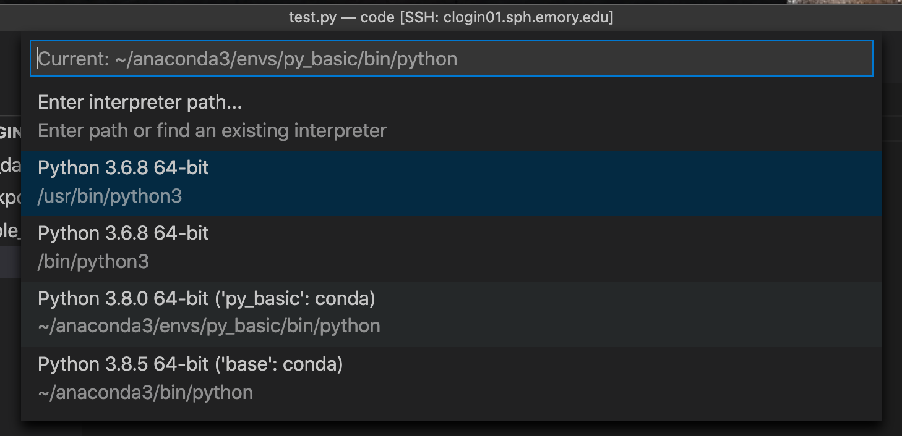

# Tutorial on remote developing in the new BIOS cluster
#### Author: Yanting Huang (yanting.huang@emory.edu)
#### Date: 01/13/2021
This tutorial aims to provide a step-by-step hands on experience on remote deloping with popular develop tools: Jupyter Notebook and VSCode.
## Work with Jupyter Notebook
prerequisite:
I assume that you have installed all Jupyter notebook related libraries and necessary Python/R library via Anaconda and named the environment with name `my_env`. <br>
* The step prefixed with (from remote) are commands to be executed while you are on the cluster. 
* The step prefixed with (from local) are commands to be executed while you are on your local environment. 

Steps:
01. (from remote) Login and activate the Conda environment for development.
```
conda activate my_env
```

02. (from remote) Start a interactive session on the cluster for development. Note that directly running the program on the login node is strictly forbidden and it would affect the other user's experience.
```
srun --pty -N 1 -n 2 --mem=32G -t 2:00:00 -p interactive-cpu bash
```
* Here you can change the parameters specified in the `srun` command to fit your need. Here I asked for 1 node with 2 cores and 32G RAM for 2 hours.
* Get the assigned node number. You should be able to find it in the command line prompt (It is `node22` in this example.): 
```
[yhua295@node22 ~]$
```


03. (from remote) Start the jupyter notebook. Remember that when you start the jupyter notebook from local, the default setting is to open a browser. It would not be possible to do so directly from remote. Here, we start the jupyter notebook with "no browser" mode
```
jupyter notebook --no-browser --port=8763
```
Modify the port parameter as you wish.

04. (from local) Tunnel from the local to the running notebook.
```
port=8763
ssh -t yhua295@clogin01.sph.emory.edu -L ${port}:localhost:${port} ssh node22 -L ${port}:localhost:${port}
```
Few things to notice:
* The `port` number must be consistent with the value specified in step 3
* Change `yhua295` to your user id for login
* Change `node22` to the node id you get from step 2.

05. (from local) Final step: open the notebook in your local browser
```
localhost:8763
```
You might be asked to enter a token to login. The token can be found in the log message from step 4. For example, the login token is: `ada0acc087f2db1766b88d5b6148df26392a7a4c8ea9996f`
```
    To access the notebook, open this file in a browser:
        file:///home/yhua295/.local/share/jupyter/runtime/nbserver-514531-open.html
    Or copy and paste one of these URLs:
        http://localhost:8234/?token=ada0acc087f2db1766b88d5b6148df26392a7a4c8ea9996f
     or http://127.0.0.1:8234/?token=ada0acc087f2db1766b88d5b6148df26392a7a4c8ea9996f
```

## Work with VSCode
You can also use vscode to remotely develop in the cluster. VSCode allows to interactively develop and you do not have to convert the `.ipynb` to `.py` before submitting the slurm job.
01. Login the cluster and then run the `srun` command.
```
srun --pty -N 1 -n 16 --mem=32G -t 12:00:00 -p interactive-cpu bash
```
Remember to note the node id you are assigned to.

02. Install the `Remote-SSH` extension in VSCode.

03. After you have installed the extension, you will then be able to find an green icon in the bottom left corner to establish the remote connection.


04. Click the icon and choose "Remote-SSH:Connect to Host" - "Add New SSH Host"

```
ssh -J clogin01.sph.emory.edu yhua295@node24
```
node24 is the assigned node id you noted in step 1.
You may need to modify it.

05. After you input the password twice and then you can start developing. Everything is now the same as you are used to with VSCode in the local mode. You can select the python interpreter you preferred so that you can use the anaconda environment you have built.
* Invoke the "Command Platte" (Shortcut: Shift+Command+P in Mac version) 
* Type "Python:Select Interpreter"

* Select the python in your preferred conda environment or systemwide python.


06. One powerful mode that VSCode provides is the interactive console for Python development. You can simply add `#%%` before each code block and then you will get the same developing experience that you are used to with Jupyter Notebook, which means you can execute the code block by block.
The detail can be found in this [official document](https://code.visualstudio.com/docs/python/jupyter-support-py).

07. Alternatively, you can use the jupyter notebook extension in VSCode to work with `.ipynb`. This is beyond the scope of this tutorial.


